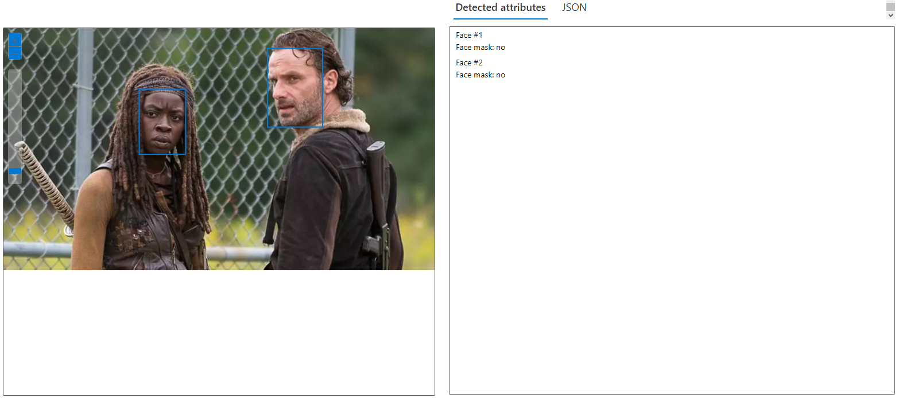
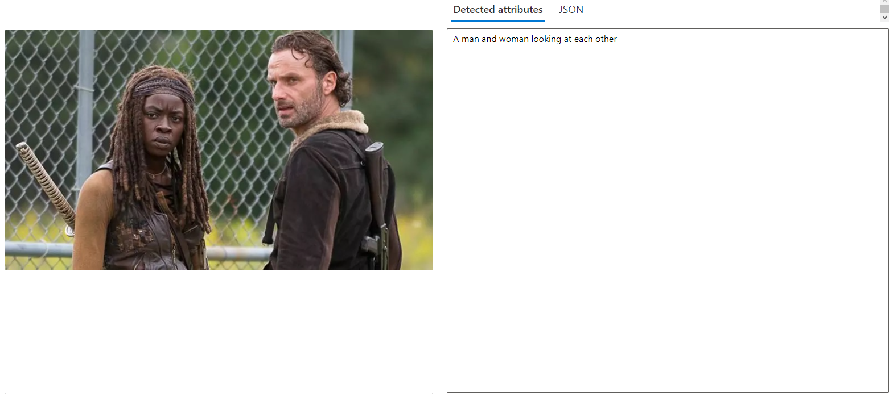

# 
# Identificando Rostos e Adicionando Descrições às Imagens no Microsoft Azure

O Microsoft Azure fornece uma série de serviços cognitivos, incluindo a capacidade de identificar rostos e adicionar descrições às imagens.

## Exemplo

### Entrada

### Saídas

## Conclusão

A utilização dos serviços cognitivos do Microsoft Azure para identificar rostos e adicionar descrições às imagens demonstra o poder e a versatilidade dessas ferramentas. Através deste processo, é possível extrair informações significativas de dados visuais, o que pode ser aplicado em uma variedade de contextos e aplicações. A capacidade de detectar rostos e gerar descrições automáticas de imagens abre novas possibilidades para o desenvolvimento de aplicações mais inteligentes e intuitivas.

